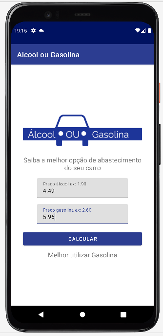

# Apresentação

Este é um aplicativo desenvolvido para calcular qual dos combustivies é mais vantagem de abastecer no momento, entre Gasolina e Alcool.
Eu desenvolvi ele para aperfeiçoamento de conhecimento em aplicativos nativos para Android.

## Recursos explorados no desenvolvimento do APP

* Utilização dos campos textInputlayout.
* Calculos e arredondamentos.
* Conversões para Double.

## Requisitos

* Gradle [https://gradle.org/](https://gradle.org/).
* Java.
* Android Studio mais recente, utilizado a versão Node ultima versão.
* Adb Devices, emulador ou aparelho fisico.

